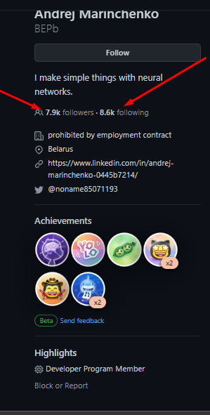
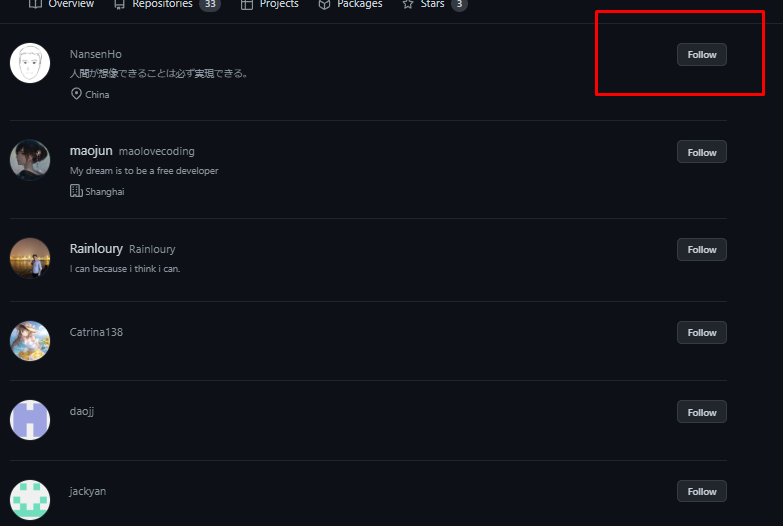
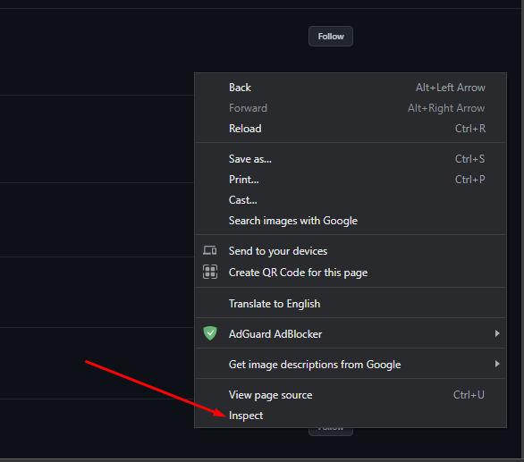
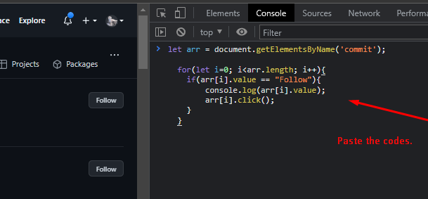

### <h1>Github Bot For Following</h1>

#### Have you agreed to many people?

#### Here is simple easy to implement your idea.

<br/>

### ✔ First, find famous github account and then click followers.

### ✔ Second, now, you can see his follwers, and if you didn't follow each person, button's label can be "Follow".

<br/>

Otherwise, displaying "Unfollow".
So your goal is to click the button of its label "Follow".

#### Now, plz, let's implement bot.

- If you can see each person with "Follow" label, at that page, press "F12" key or click "Inspect" of short menu.
- Well, and then, copy the following codes and past in the inspect bar.

## Codes:
  ```
  let arr = document.getElementsByName('commit');
  
  for(let i=0; i<arr.length; i++){
	if(arr[i].value == "Follow"){
		console.log(arr[i].value);
		arr[i].click();
	}
  }
  ```
  
  <br/>

  ### First

  <div style="border: 3px solid yellow">

  

  </div>

  <br/>

  ### Second

  <div style="border: 3px solid yellow">

  

  </div>

  <br/>

  ### Third

  <div style="border: 3px solid yellow">
  
  

  </div>

  <br/>

  ### Fourth

  <div style="border: 3px solid yellow">

  

  </div>

  <br/>

  ### Last Step:
   
   Press Enter key.
   
   
   
### <h1>LinkedIn Bot For Following</h1>

```
let elements = document.getElementsByClassName("artdeco-button artdeco-button--2 artdeco-button--full artdeco-button--secondary ember-view full-width mt2");

for (let i = 0; i < elements.length; i++) {
  console.log( elements[i].querySelector('.artdeco-button__text').textContent.trim() )
  if( elements[i].querySelector('.artdeco-button__text').textContent.trim() === "Follow" ){
    elements[i].click()
    console.log( 'Here' );
  }
}
```
